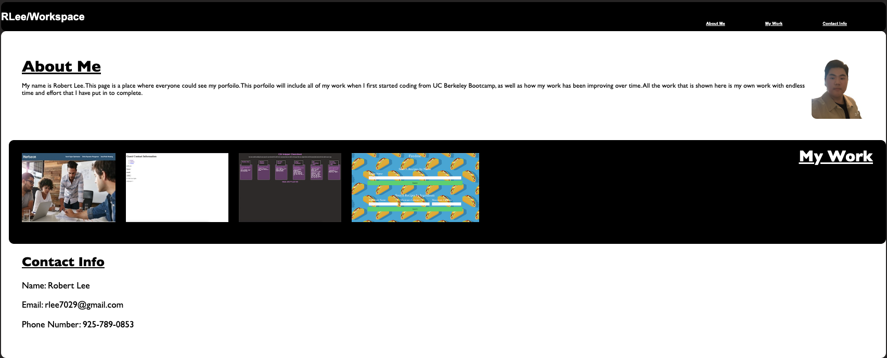

# hw2

## Techonlogies Used
During this project. I used the following techonlogies
    - Index.html
    - CSS
    - README.md
    - Gitlab
    - Github
    - Edamam API
    - ThemealDB API
    -Google Fonts
    - Javascript

## Description
This project was made to show my work throuhg out the process of coding bootcamp. It will be improving as times goes and being updated. This page will show you what types of work that I have done so far and the progress that I have made. Also if there is any questions or more works that is needed to be seen, there is contact info where anyone could reach me. 

## Credits
N/A

## Usage
Please click the navigator bar to direct you to information you may want to see. 
If you click the picture from "My Work" section, it will take you to the page where my page is live. 

